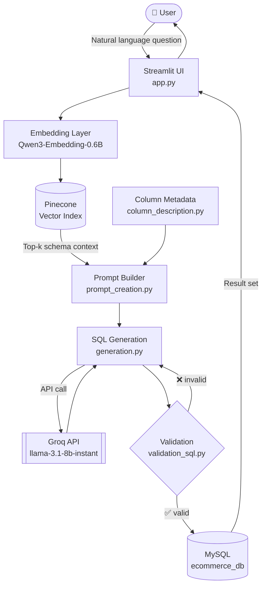

# QuickQuery 🚀

**Ask your database questions in plain English.**

QuickQuery is a Streamlit application that turns natural-language questions into validated, executable SQL against a MySQL e-commerce database. It combines semantic schema retrieval (Pinecone + Qwen embeddings) with fast LLM inference (Groq) to generate queries that are grounded in your actual schema — not hallucinated from thin air.

<p align="left">
  
  
  
  
  
  
</p>

---

## 📑 Table of Contents

- [Why QuickQuery](#-why-quickquery)
- [Features](#-features)
- [How It Works](#-how-it-works)
- [Architecture](#-architecture)
- [Tech Stack](#-tech-stack)
- [Project Structure](#-project-structure)
- [Prerequisites](#-prerequisites)
- [Installation & Setup](#-installation--setup)
- [Environment Variables](#-environment-variables)
- [Running the Application](#-running-the-application)
- [Usage Examples](#-usage-examples)
- [Module Reference](#-module-reference)
- [Troubleshooting](#-troubleshooting)
- [Roadmap](#-roadmap)
- [Contributing](#-contributing)
- [License](#-license)

---

## 💡 Why QuickQuery

Most text-to-SQL demos break the moment a schema grows past a handful of tables. Stuffing an entire database definition into a prompt is expensive, noisy, and quickly exceeds the context window.

QuickQuery takes a retrieval-first approach:

1. **Schema and column descriptions are embedded once** and stored in a Pinecone index.
2. At query time, only the **most semantically relevant tables and columns** are pulled into the prompt.
3. The generated SQL is **validated before execution**, so malformed or unsafe statements never reach the database.

The result is a system that stays accurate as the schema scales, keeps token costs low, and gives non-technical users a safe path to the data.

---

## ✨ Features

| Feature | Description |
|---|---|
| 🗣️ **Natural language → SQL** | Ask questions conversationally; QuickQuery produces the corresponding MySQL query. |
| 🔍 **Semantic schema retrieval** | Pinecone returns only the tables and columns relevant to the question, keeping prompts small and focused. |
| 🛡️ **SQL validation layer** | Generated queries are parsed and checked before execution to block malformed and destructive statements. |
| ⚡ **Low-latency inference** | Groq's LPU inference on `llama-3.1-8b-instant` keeps round-trips fast. |
| 🧩 **Rich column metadata** | Human-readable column descriptions give the model business context, not just raw column names. |
| 📊 **Results in the browser** | Query output is rendered directly in Streamlit as an interactive table. |
| 🔐 **Credential isolation** | All secrets live in `.env` and are never committed to version control. |

---

## ⚙️ How It Works

```text
User question
     │
     ▼
[1] Embed the question          →  Qwen3-Embedding-0.6B
     │
     ▼
[2] Retrieve relevant schema    →  Pinecone similarity search over
     │                             table / column descriptions
     ▼
[3] Build the prompt            →  question + retrieved schema + few-shot rules
     │
     ▼
[4] Generate SQL                →  Groq · llama-3.1-8b-instant
     │
     ▼
[5] Validate SQL                →  syntax check + safety guardrails
     │
     ▼
[6] Execute against MySQL       →  results returned as a DataFrame
     │
     ▼
[7] Render in Streamlit         →  table + generated query shown to the user
```

---

## 🏗️ Architecture



---

## 🛠️ Tech Stack

| Layer | Technology |
|---|---|
| **UI / Frontend** | [Streamlit](https://streamlit.io/) |
| **Language** | Python 3.10+ |
| **Relational Database** | MySQL 8.x |
| **Vector Database** | [Pinecone](https://www.pinecone.io/) |
| **LLM Inference** | [Groq API](https://groq.com/) — `llama-3.1-8b-instant` |
| **Embeddings** | [Hugging Face](https://huggingface.co/) — `Qwen/Qwen3-Embedding-0.6B` |
| **Config Management** | `python-dotenv` |

---

## 📁 Project Structure

```text
QuickQuery/
│
├── ecommerce_db/           # SQL scripts, schema definitions, and seed data
├── quickquery/             # Local virtual environment (git-ignored)
│
├── app.py                  # Streamlit entry point — UI, session state, orchestration
├── global_variables.py     # Centralised config, constants, and env loading
│
├── mysql_connection.py     # MySQL connection pooling and query execution
├── column_description.py   # Table/column metadata and business descriptions
├── content_extraction.py   # Schema extraction and preprocessing utilities
│
├── vector_db_config.py     # Pinecone client, index setup, upsert & similarity search
├── prompt_creation.py      # Dynamic prompt templates and few-shot construction
├── generation.py           # LLM orchestration — sends prompts, parses SQL output
├── validation_sql.py       # SQL syntax validation and safety guardrails
│
├── requirements.txt        # Python dependencies
├── .env                    # Secrets and configuration (never commit this)
├── .gitignore              # Git ignore rules
└── README.md               # You are here
```

---

## 📋 Prerequisites

Before you begin, make sure the following are installed and available:

| Requirement | Notes |
|---|---|
| **Python 3.10+** | `python --version` to confirm |
| **MySQL Server 8.x** | Running locally or reachable over the network |
| **Git** | For cloning the repository |
| **Groq API key** | Free tier available at [console.groq.com](https://console.groq.com/) |
| **Pinecone API key** | Free tier available at [app.pinecone.io](https://app.pinecone.io/) |
| **Hugging Face token** | Required for gated/hosted embedding access — [huggingface.co/settings/tokens](https://huggingface.co/settings/tokens) |

---

## 🚀 Installation & Setup

### 1. Clone the repository

```bash
git clone https://github.com/AbhishekBiswas-github/QuickQuery.git
cd QuickQuery
```

### 2. Create and activate a virtual environment

```bash
python -m venv quickquery
```

**Windows (PowerShell)**
```powershell
.\quickquery\Scripts\Activate.ps1
```

**Windows (CMD)**
```cmd
.\quickquery\Scripts\activate.bat
```

**macOS / Linux**
```bash
source quickquery/bin/activate
```

### 3. Install dependencies

```bash
pip install --upgrade pip
pip install -r requirements.txt
```

### 4. Set up the MySQL database

Create the database and load the schema from the `ecommerce_db/` directory:

```bash
mysql -u your_db_user -p -e "CREATE DATABASE ecommerce_db;"
mysql -u your_db_user -p ecommerce_db < ecommerce_db/schema.sql
```

> Adjust the file names above to match the scripts actually present in `ecommerce_db/`. If seed data is provided separately, load it the same way.

### 5. Configure environment variables

Create a `.env` file in the project root:

```bash
cp .env.example .env   # if an example file is provided
```

Otherwise, create `.env` manually using the template in the next section.

### 6. Build the vector index

Embed your schema and column descriptions into Pinecone before the first run:

```bash
python vector_db_config.py
```

> Re-run this step whenever the database schema or column descriptions change, so retrieval stays in sync with the live schema.

---

## 🔑 Environment Variables

Create a `.env` file in the project root with the following keys. **Never commit this file** — it is already listed in `.gitignore`.

```dotenv
# ---------- DATABASE CREDENTIALS -------------
HOST=localhost
DB_USER=your_db_user
DATABASE_PASSWORD=your_secure_password
PORT=3306
TYPE=MySQL
DATABASE_NAME=ecommerce_db

# ---------- LLM / MODEL -------------
MODEL_NAME='llama-3.1-8b-instant'
GROQ_API_KEY="your_groq_api_key_here"
EMBEDDING_MODEL="Qwen/Qwen3-Embedding-0.6B"

# ---------- PINECONE -----------
PINECONE_API_KEY="your_pinecone_api_key_here"
PINECONE_INDEX_NAME="quickquery-index"

# ---------- HUGGING FACE -----------
HUGGINGFACE_API_KEY="your_huggingface_api_key_here"
```

### Reference

| Variable | Required | Description |
|---|:---:|---|
| `HOST` | ✅ | MySQL host address (e.g. `localhost`) |
| `DB_USER` | ✅ | MySQL username |
| `DATABASE_PASSWORD` | ✅ | MySQL password |
| `PORT` | ✅ | MySQL port — defaults to `3306` |
| `TYPE` | ✅ | Database dialect — `MySQL` |
| `DATABASE_NAME` | ✅ | Target schema name |
| `MODEL_NAME` | ✅ | Groq model identifier used for SQL generation |
| `GROQ_API_KEY` | ✅ | API key for Groq inference |
| `EMBEDDING_MODEL` | ✅ | Hugging Face embedding model ID |
| `PINECONE_API_KEY` | ✅ | API key for the Pinecone vector database |
| `PINECONE_INDEX_NAME` | ✅ | Name of the Pinecone index holding schema embeddings |
| `HUGGINGFACE_API_KEY` | ✅ | Token for Hugging Face model access |

> ⚠️ **Security note:** the values above are placeholders. Rotate any key that has ever been committed to a repository or shared in plain text.

---

## ▶️ Running the Application

With the virtual environment active and `.env` configured:

```bash
streamlit run app.py
```

Streamlit will print a local URL — typically **http://localhost:8501**. Open it in your browser and start asking questions.

To run on a different port:

```bash
streamlit run app.py --server.port 8502
```

---

## 💬 Usage Examples

Once the app is running, try questions like these:

| Question | What QuickQuery does |
|---|---|
| *"What were the top 10 selling products last month?"* | Joins orders and products, aggregates quantity, applies a date filter, sorts and limits. |
| *"Which customers have placed more than five orders?"* | Groups orders by customer with a `HAVING` clause. |
| *"Show total revenue by product category."* | Aggregates revenue and joins through the category dimension. |
| *"List orders that are still pending shipment."* | Filters on order status. |
| *"What's the average order value per region this quarter?"* | Aggregates with a date range and regional grouping. |

Each response shows both the **generated SQL** and the **result set**, so you can verify the query before trusting the numbers.

---

## 🧩 Module Reference

| Module | Responsibility |
|---|---|
| **`app.py`** | Streamlit entry point. Renders the UI, manages session state, and orchestrates the retrieve → generate → validate → execute pipeline. |
| **`global_variables.py`** | Loads environment variables and exposes shared constants and configuration to every other module. |
| **`mysql_connection.py`** | Establishes and manages MySQL connections; executes validated queries and returns result sets. |
| **`content_extraction.py`** | Extracts schema information from the live database and preprocesses it into embeddable text. |
| **`column_description.py`** | Holds human-readable descriptions for tables and columns, giving the LLM business context beyond raw identifiers. |
| **`vector_db_config.py`** | Configures the Pinecone client, creates the index, upserts schema embeddings, and runs similarity searches. |
| **`prompt_creation.py`** | Assembles the final prompt from the user question, retrieved schema context, and SQL generation rules. |
| **`generation.py`** | Calls the Groq API, handles retries, and parses the model output into a clean SQL string. |
| **`validation_sql.py`** | Validates generated SQL for syntax correctness and blocks unsafe operations before execution. |

---

## 🔧 Troubleshooting

<details>
<summary><strong>MySQL connection refused / access denied</strong></summary>

- Confirm the MySQL service is running: `mysql -u your_db_user -p`
- Verify `HOST`, `PORT`, `DB_USER`, and `DATABASE_PASSWORD` in `.env`
- Ensure the user has `SELECT` privileges on the target schema

</details>

<details>
<summary><strong>Pinecone index not found</strong></summary>

- Confirm `PINECONE_INDEX_NAME` matches the index in your Pinecone console
- Run `python vector_db_config.py` to create and populate the index
- Check that the index dimension matches the embedding model's output size

</details>

<details>
<summary><strong>Groq API errors (401 / 429)</strong></summary>

- `401` — the API key is missing or invalid; re-check `GROQ_API_KEY`
- `429` — rate limit reached; wait and retry, or reduce request frequency

</details>

<details>
<summary><strong>Generated SQL is wrong or incomplete</strong></summary>

- Enrich the entries in `column_description.py` — better descriptions produce better queries
- Re-run the embedding step so Pinecone reflects the updated metadata
- Increase the number of retrieved schema chunks if the question spans many tables

</details>

<details>
<summary><strong>ModuleNotFoundError after installation</strong></summary>

- Confirm the virtual environment is active (your prompt should show `(quickquery)`)
- Reinstall dependencies: `pip install -r requirements.txt`

</details>

---

## 🗺️ Roadmap

- [ ] Multi-turn conversational follow-ups with query history
- [ ] Automatic chart generation from result sets
- [ ] Support for additional dialects (PostgreSQL, SQLite, BigQuery)
- [ ] Query cost estimation and row-limit guardrails
- [ ] Self-correction loop that feeds execution errors back to the model
- [ ] Export results to CSV and Excel
- [ ] Dockerised deployment with `docker-compose`

---

## 🤝 Contributing

Contributions are welcome.

1. Fork the repository
2. Create a feature branch — `git checkout -b feature/your-feature`
3. Commit your changes — `git commit -m "Add your feature"`
4. Push the branch — `git push origin feature/your-feature`
5. Open a Pull Request

Please keep changes focused, and make sure the app still runs end to end before submitting.

---

## 🛡️ License

This project is open source and available under the [MIT License](LICENSE).

---

## 👤 Author

**Abhishek Biswas**
[GitHub](https://github.com/AbhishekBiswas-github)

---

<p align="center">Built with Streamlit, Groq, and Pinecone.</p>
